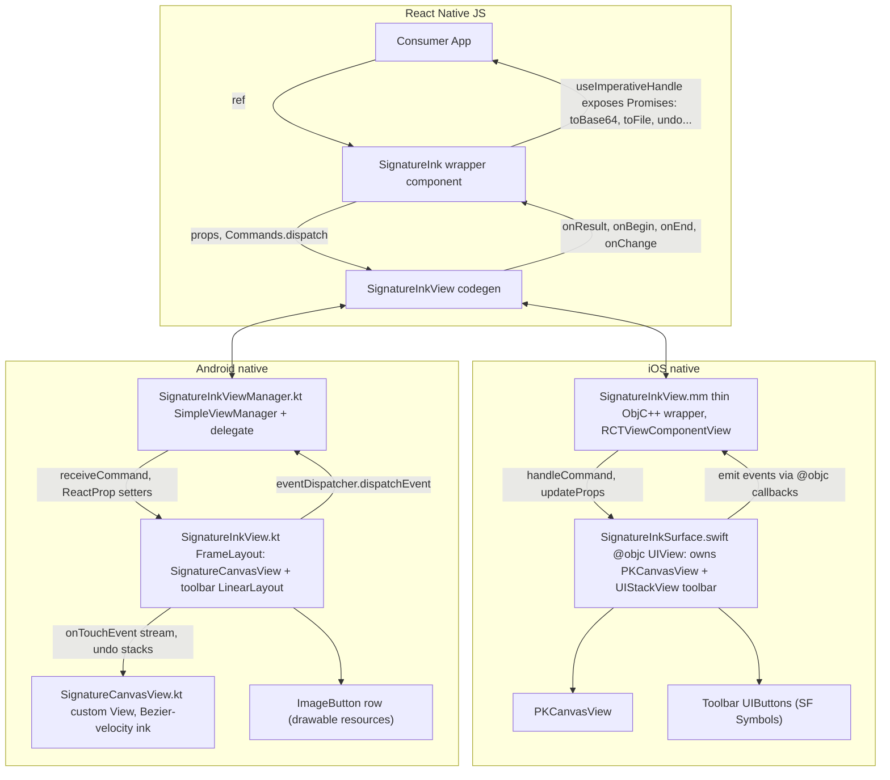

## Architecture




Two layers in JS:

- `SignatureInkView` (low-level): the codegen native component. Power-user surface.
- `SignatureInk` (high-level wrapper): owns `onResult` handling, exposes a Promise-based ref API via `useImperativeHandle`. The default export.

## JS API (final consumer DX)

```tsx
const ref = useRef<SignatureInkHandle>(null);

<SignatureInk
  ref={ref}
  style={{ flex: 1 }}
  penColor="#111"
  penMinWidth={1}
  penMaxWidth={3}
  backgroundColor="transparent"
  showBaseline
  pencilOnly={false}
  showToolbar
  toolbarPosition="bottom"
  toolbarButtons={['undo', 'redo', 'clear', 'copy']}
  // iOS-only PencilKit system tool picker (no-op on Android)
  showToolPicker={false}
  defaultInkType="pen"          // 'pen' | 'pencil' | 'marker' | 'monoline' | 'fountainPen' | 'watercolor' | 'crayon'
  onChange={({ isEmpty, strokeCount }) => ...}
  onBegin={() => ...}
  onEnd={() => ...}
/>

await ref.current.toBase64({ format: 'png', trim: true });   // string
await ref.current.toFile({ format: 'jpeg', quality: 0.9 });  // file:// path
await ref.current.toSvg();                                   // string
await ref.current.getStrokeData();                           // {x,y,t,pressure}[][]
ref.current.setStrokeData(json);                             // load existing
ref.current.replay({ speed: 1 });
ref.current.undo(); ref.current.redo(); ref.current.clear();
ref.current.copyToClipboard();
await ref.current.isEmpty();                                 // boolean
```

## Files to create / modify

### src/

- [src/SignatureInkViewNativeComponent.ts](src/SignatureInkViewNativeComponent.ts) — expand `NativeProps`, add `DirectEventHandler` events, emit `Commands` via `codegenNativeCommands`.
- [src/SignatureInk.tsx](src/SignatureInk.tsx) — new. High-level wrapper component with `forwardRef` + `useImperativeHandle`. Owns a `Map<requestId, {resolve, reject}>`, generates request IDs, dispatches commands via codegen `Commands`, resolves promises on `onResult`. Forwards `onBegin`/`onEnd`/`onChange`/`onToolbarAction`.
- [src/SignatureInkView.tsx](src/SignatureInkView.tsx) — keep as the throw-on-web stub; on native re-export the raw codegen component for power users.
- [src/SignatureInkView.native.tsx](src/SignatureInkView.native.tsx) — re-export raw codegen component.
- [src/types.ts](src/types.ts) — new. Shared types: `SignatureInkHandle`, `ExportFormat`, `ToolbarButton`, `StrokePoint`, `StrokeData`.
- [src/index.tsx](src/index.tsx) — export `SignatureInk` (default), `SignatureInkView` (raw), and types.

### ios/ (Swift owns the logic; ObjC++ is a thin codegen bridge)

- [ios/SignatureInkView.h](ios/SignatureInkView.h) — unchanged.
- [ios/SignatureInkView.mm](ios/SignatureInkView.mm) — rewrite as a thin wrapper:
  - Hold a `SignatureInkSurface *` (Swift class, imported from `SignatureInk-Swift.h`).
  - In `initWithFrame:` create it and set as `contentView`.
  - In `updateProps:` diff codegen props and forward to Swift setters (`setPenColor:`, `setPenMinWidth:`, etc.).
  - Override `handleCommand:args:` and dispatch to Swift methods (`-clear`, `-undo`, `-toBase64:format:quality:trim:`, etc.).
  - Set an `@objc` callback block on the Swift surface that invokes `_eventEmitter` (cast to `SignatureInkViewEventEmitter`) for each event type.
- [ios/SignatureInkSurface.swift](ios/SignatureInkSurface.swift) — new. `@objc public class SignatureInkSurface: UIView`:
  - Embeds a `PKCanvasView` (`drawingPolicy = .anyInput` or `.pencilOnly`, `backgroundColor = .clear`).
  - Configures ink via `PKInkingTool(<inkType>, color: penColor, width: penMaxWidth)` where `<inkType>` comes from `defaultInkType` (default `.pen`).
  - Conforms to `PKCanvasViewDelegate` for stroke-began/ended/changed callbacks → fires `onBegin`/`onEnd`/`onChange`.
  - Maintains its own undo/redo stack as `[PKDrawing]` snapshots (PKCanvasView's `undoManager` is responder-based and unreliable in Fabric).
  - Embeds a `UIStackView` toolbar (top or bottom) of `UIButton`s with `UIImage(systemName: "arrow.uturn.backward" | "arrow.uturn.forward" | "doc.on.clipboard" | "trash")`. Buttons call the same Swift methods commands do.
  - `**PKToolPicker` (opt-in via `showToolPicker`)**:
    - In `didMoveToWindow()`, if `showToolPicker && window != nil`: lazily create the picker — `PKToolPicker()` on iOS 14+ (use `PKToolPicker.shared(for: window)` as a fallback) — call `toolPicker.addObserver(canvasView)`, `toolPicker.setVisible(true, forFirstResponder: canvasView)`, and `canvasView.becomeFirstResponder()`.
    - When toggled off / view removed from window: `setVisible(false, ...)`, `removeObserver(canvasView)`, `canvasView.resignFirstResponder()`.
    - Override `canBecomeFirstResponder` → `true` on the surface so the canvas can receive picker updates.
    - When the picker is visible, `penColor` / `penMinWidth` / `penMaxWidth` / `defaultInkType` become the *initial* tool only; subsequent strokes use whatever tool the user picks (including highlighter, eraser, etc.). The built-in toolbar still works alongside.
    - Document the asymmetry: `showToolPicker` is iOS-only and silently ignored on Android (Android has no system equivalent; users get the fixed pen + custom toolbar).
  - Export helpers:
    - `toUIImage(trim: Bool) -> UIImage` via `drawing.image(from: trimRect, scale: UIScreen.main.scale)`.
    - `toSvg() -> String` by walking `drawing.strokes[].path` (`PKStrokePath`), emitting cubic-Bezier `<path d="...">` from interpolated control points.
    - `toStrokeData() -> [[StrokePoint]]` by sampling `PKStrokePath.interpolatedPoints(by:)` and capturing `(location, timeOffset, force, azimuth, altitude)`.
    - `setStrokeData(_:)` rebuilds `PKDrawing` from JSON (synthesize `PKStroke`/`PKStrokePath` with control points and `PKFloat4`).
    - `replay(speed:)` animates by progressively assigning sub-drawings on a `CADisplayLink`.
- [ios/SignatureInk-Bridging-Header.h](ios/SignatureInk-Bridging-Header.h) — new. Empty (or `#import <UIKit/UIKit.h>`); needed only to enable Swift compilation in the pod.
- [SignatureInk.podspec](SignatureInk.podspec) — already globs `*.swift`; add `s.swift_version = "5.0"` and `s.pod_target_xcconfig = { "SWIFT_OBJC_BRIDGING_HEADER" => "ios/SignatureInk-Bridging-Header.h", "DEFINES_MODULE" => "YES" }` so `SignatureInk-Swift.h` is generated and importable from `.mm`.

### android/ (Kotlin only)

- [android/src/main/java/com/signatureink/SignatureInkViewManager.kt](android/src/main/java/com/signatureink/SignatureInkViewManager.kt) — expand:
  - Add all `@ReactProp` setters matching codegen props.
  - Override `receiveCommand(view, commandId, args)` for `clear`, `undo`, `redo`, `copyToClipboard`, `toBase64`, `toFile`, `toSvg`, `getStrokeData`, `setStrokeData`, `replay`, `isEmpty`.
  - Use `UIManagerHelper.getEventDispatcherForReactTag(...).dispatchEvent(...)` to emit `onBegin`/`onEnd`/`onChange`/`onResult`/`onToolbarAction` (one `Event` subclass per type, or a single typed dispatcher).
- [android/src/main/java/com/signatureink/SignatureInkView.kt](android/src/main/java/com/signatureink/SignatureInkView.kt) — rewrite as a `FrameLayout`:
  - Hosts a `SignatureCanvasView` plus an optional toolbar `LinearLayout` of `ImageButton`s positioned top/bottom.
  - Exposes setters used by the ViewManager and dispatches command calls down to the canvas view.
  - Owns the event-callback lambdas wired up from the ViewManager.
- [android/src/main/java/com/signatureink/SignatureCanvasView.kt](android/src/main/java/com/signatureink/SignatureCanvasView.kt) — new. Custom `View`:
  - `onTouchEvent`: collect `TimedPoint(x, y, t)` per `MotionEvent`; on `ACTION_DOWN` start a new `Stroke`; on `ACTION_MOVE` append + compute Bezier segments; on `ACTION_UP` finalize.
  - Bezier-velocity algorithm (port of warting/gcacace): for each triple of consecutive points compute `ControlTimedPoints`, draw via `Bezier.draw(canvas, paint, startWidth, endWidth)` segmenting into N straight lines; width = lerp(prev, current) with `velocityFilterWeight` smoothing on inverse velocity.
  - Maintain `undoStack: ArrayDeque<Stroke>` and `redoStack: ArrayDeque<Stroke>`; rebuild via offscreen `Bitmap` cache.
  - Pencil-only mode: in `onTouchEvent`, ignore events whose `getToolType(0)` isn't `TOOL_TYPE_STYLUS`.
  - Optional baseline: draw a 1px horizontal guide line at `baselineOffsetFromBottom`.
  - Export:
    - `toBitmap(trim: Boolean): Bitmap` — render strokes to a sized bitmap, cropped to bounding box if `trim`.
    - `toSvg(): String` — walk strokes, emit `<path d="M x,y Q cx,cy x,y ...">` per stroke.
    - `toStrokeData(): List<List<StrokePoint>>` — serialize `Stroke` lists.
    - `setStrokeData(json)` — rebuild and `invalidate()`.
    - `replay(speed)` — animate via `Choreographer` or `ValueAnimator` redrawing progressively.
- [android/src/main/java/com/signatureink/ink/TimedPoint.kt](android/src/main/java/com/signatureink/ink/TimedPoint.kt), [ControlTimedPoints.kt](android/src/main/java/com/signatureink/ink/ControlTimedPoints.kt), [Bezier.kt](android/src/main/java/com/signatureink/ink/Bezier.kt), [Stroke.kt](android/src/main/java/com/signatureink/ink/Stroke.kt) — new. Math primitives ported from warting/android-signaturepad.
- [android/src/main/res/drawable/ic_signature_undo.xml](android/src/main/res/drawable/ic_signature_undo.xml), `ic_signature_redo.xml`, `ic_signature_copy.xml`, `ic_signature_clear.xml` — placeholder vector drawables (24dp). You'll replace them with the SF-Symbols-exported XMLs later; the loader uses `R.drawable.ic_signature_`* by name so the swap is drop-in.
- [android/src/main/AndroidManifest.xml](android/src/main/AndroidManifest.xml) — unchanged.

## Native props (codegen spec, `src/SignatureInkViewNativeComponent.ts`)

- Pen: `penColor: ColorValue`, `penMinWidth: Float`, `penMaxWidth: Float`, `velocityFilterWeight: Float` (0..1, default 0.7), `defaultInkType: WithDefault<'pen' | 'pencil' | 'marker' | 'monoline' | 'fountainPen' | 'watercolor' | 'crayon', 'pen'>` (iOS-only; Android always uses pen).
- Surface: `backgroundColor: ColorValue` (default transparent), `showBaseline: bool`, `baselineColor: ColorValue`, `baselineOffsetFromBottom: Float`.
- Input: `pencilOnly: bool` (iOS `PKCanvasView.drawingPolicy = .pencilOnly`; Android stylus-only filter).
- Toolbar: `showToolbar: bool`, `toolbarPosition: WithDefault<'top' | 'bottom', 'bottom'>`, `toolbarButtons: ReadonlyArray<'undo' | 'redo' | 'clear' | 'copy'>`, `toolbarBackgroundColor: ColorValue`, `toolbarTintColor: ColorValue`.
- PencilKit system tool picker (iOS-only, no-op on Android): `showToolPicker: bool` (default `false`).
- Events: `onBegin`, `onEnd`, `onChange({isEmpty, strokeCount})`, `onResult({requestId, type, value?, error?})`, `onReplayProgress({progress})`, `onToolbarAction({action})`.

## Fabric commands (codegen `Commands`)

`clear`, `undo`, `redo`, `copyToClipboard` — fire-and-forget.

`toBase64(requestId, format, quality, trim)`, `toFile(requestId, format, quality, trim)`, `toSvg(requestId)`, `getStrokeData(requestId)`, `isEmpty(requestId)` — fire-and-forget; result delivered via `onResult` event matched by `requestId`. The high-level `SignatureInk` wrapper hides this entirely.

`setStrokeData(jsonString)`, `replay(speed)` — fire-and-forget; `replay` streams `onReplayProgress`.

## v1 scope confirmation

PNG + JPEG (file + base64), SVG, raw stroke data with `{x, y, t, pressure}`, replay, Apple-Pencil-only mode, undo/redo, clear, copy-to-clipboard, transparent background, baseline guide, native overlay toolbar, onBegin/onEnd/onChange events, optional PencilKit `PKToolPicker` on iOS. As requested ("full" scope).

## Build / integration notes

- Swift–ObjC++interop: in `SignatureInk.podspec` add `s.swift_version = "5.0"` and a `pod_target_xcconfig` with `SWIFT_OBJC_BRIDGING_HEADER` + `DEFINES_MODULE = YES`. The `.mm` imports `<SignatureInk/SignatureInk-Swift.h>` (auto-generated). Only `@objc`-exposed Swift members are visible to ObjC++.
- Min iOS: PencilKit needs iOS 13+; `drawingPolicy = .anyInput` needs iOS 14+. RN 0.85 baseline (iOS 15.1) covers both.
- Android: `minSdkVersion 24` already set; vector drawables and `MotionEvent.TOOL_TYPE_STYLUS` are both fine.
- Codegen regenerates after editing `SignatureInkViewNativeComponent.ts`; running the example app once after the spec change rebuilds the generated `SignatureInkViewSpec` headers used by `SignatureInkView.mm`.
- New architecture only (already enabled via the `fabric-view` template).

## Out of scope for v1

- Per-stroke color/tool on Android (Android ink is single-pen; on iOS, `PKToolPicker` makes this iOS-only).
- An Android equivalent of `PKToolPicker` (no system component exists; custom multi-tool UI is future work).
- Customizable in-canvas toolbar layouts beyond top/bottom + button list.

